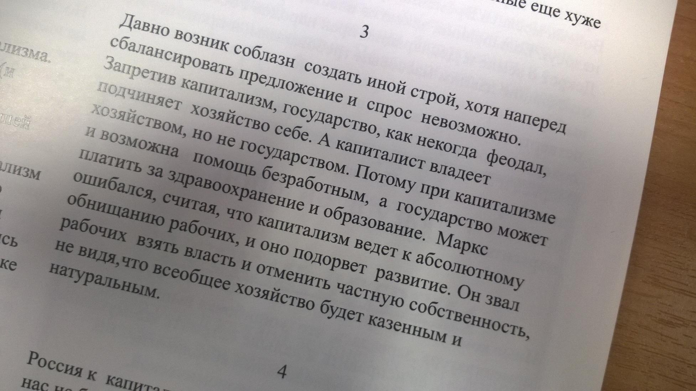
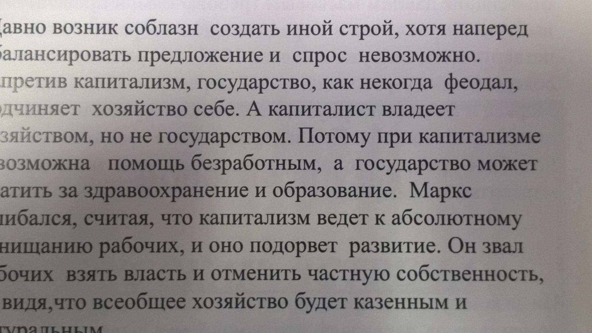
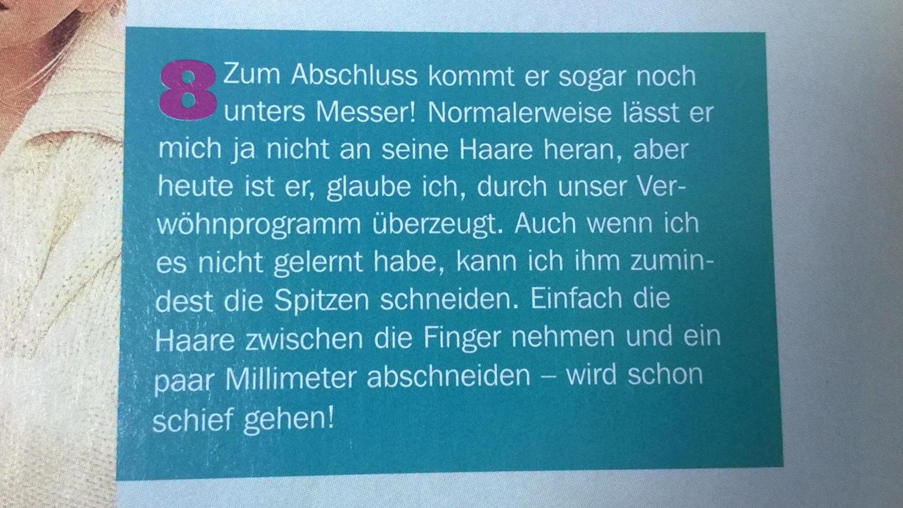
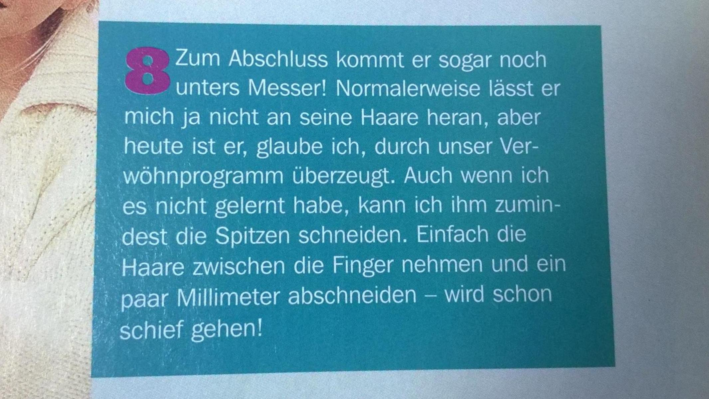

# Быстрое преобразование Хафа

## Реализация 

Подробную реализацию можно найти в файле [FHT.py](./src/FHT.py)

Запуск для обработки определенной картинки (или всех картинок из папки images) находится в файле [process_image.py](./process_image.py)

Команда для запуска:
```sh
python3 process_image.py [path_to_image or 'all']
```

## Оценка качества результата и сравнение интерполяций

Все результаты обработки изображений можно найти в [results](./results/). Мы рассмотрим несколько ключевых, которые будут характеризовать работу в целом.

Исходное:



После обработки:



Из-за необходимости обрезать картинку до степени двойки результат получился смещенным. Так же причиной является перепад градиентов со столом, поэтому текст выглядит менее приоритетным (пытаемся отобразить всю бумагу).

Исходное:


Интерполяция ближайшими соседями:



Билинейная интерполяция:



Из далека кажется, что картинки по качеству одинаковые, но при приближении видно, что билинейная интерполяция более качественная, так как буквы лучше пропечатываются.

## Оценка времени работы

### Теоретическая оценка

* Все функции предобработки можно оценить $O(N^2)$
* БПХ реализуется рекурсивно с глубиной рекурсии $\log N$, при этом всего проверок $N^2$ откуда получаем сложность $O(N^2 \log N)$
* Определение угла потребует полного прохода по всем значениям в табилице, поэтому можно считать $O(M \cdot N)$. Для простоты будем считать, что это порядка $O(N^2)$, так как стороны отличаются в константное число раз.
* Для вычисления координат необходимо сопоставить им координаты, которые были до всех преобразований (поворотов, сжатий, сдвигов). На вычисления координат достаточно $O(1)$ действий. По известному углу требует константного числа действий. Интерполяция так же требует константного числа действий, так как мы смотрим на значение ближайших соседей и из них делаем вывод.
* Для полного поворота необходимо преобразовать все координаты, поэтому  $O(N^2)$.

Тогда итоговая сложность по всем шагам: $O(N^2 \log N)$.

### Практическая оценка

Вывод по практической оценки и процесс ее получения можно найтив в [соответствующем файле](./calculate_speed.ipynb). 

Краткий вывод: результаты согласуются с теорией.

## Предполагаемые улучшения

1. Улучшения определения границ документов. Чтобы не обрезать изображения до степени и учитывать структуру изображений.
2. Реализовать параллельное вычисление алгоритма для увеличения скорости.
3. Переписать код на c++ (это будет значительно быстрее, но реализация требует более аккуратной работы с переполнением типов при вычислении таблицы БПХ, собственных реализаций выборочных дисперсий и прочих частей для реализации алгоритма)
